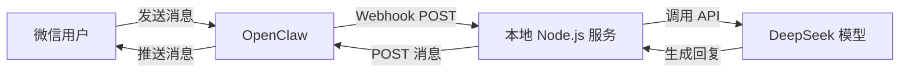

---

## 1. 准备工作

### 1.1 账号与环境

- **OpenClaw**: 注册账号并创建 Agent，获取 API Key 和 Webhook Secret。
  - 示例：`OPENCLAW_API_KEY=oc_live_1234567890`
  - 示例：`OPENCLAW_WEBHOOK_SECRET=whsec_0987654321`

- **DeepSeek**: 注册账号获取 API Key。
  - 示例：`DEEPSEEK_API_KEY=sk-xxxxxxxxxxxxxxxx` 

- **Node.js**: 需安装 18+，内置支持 fetch API。
- **ngrok**: 用于将本地端口映射到公网，供 Webhook 访问。
- **编辑器**: 推荐 VSCode，便于代码高亮和调试。

### 1.2 初始化项目

打开终端执行：
```bash
mkdir wechat-ai-bot && cd wechat-ai-bot
npm init -y
npm install express dotenv
```
在 `package.json` 中加入：
```json
"type": "module"
```
以启用 ES Module 语法。

创建 `.env` 文件保护密钥：
```
OPENCLAW_API_KEY=oc_live_1234567890
OPENCLAW_WEBHOOK_SECRET=whsec_0987654321
DEEPSEEK_API_KEY=sk-xxxxxxxxxxxxxxxx
PORT=3000
```

创建 `.gitignore` 防止泄露：
```
node_modules/
.env
```

项目结构示例：
```
wechat-ai-bot/
├── index.js        # 入口文件：负责启动 Web 服务器并接收 Webhook 请求
├── handler.js      # 消息处理逻辑：协调记忆读取、AI 调用和消息推送
├── llm.js          # 大模型调用：封装 DeepSeek API，处理 Prompt 指令
├── wechat.js       # 微信推送：负责将 AI 生成的内容发回 OpenClaw 接口
├── memory.js       # 简单记忆存储：在内存中临时管理用户的对话上下文
├── .env            # 环境变量：存放 API Key 等敏感配置信息（不提交到代码库）
├── .gitignore      # 忽略文件：设置哪些文件（如 .env）不需要被 Git 追踪
└── package.json    # 项目配置文件：定义项目依赖（express, dotenv）和运行方式
```

---

## 2. 代码实现

### 2.1 Webhook 入口 (index.js)
```js
import 'dotenv/config'
import express from 'express'
import crypto from 'crypto'
import { handleMessage } from './handler.js'

const app = express()

app.post('/webhook', express.raw({ type: 'application/json' }), async (req, res) => {
  const signature = req.headers['x-claw-signature']
  const rawBody = req.body.toString()

  // 安全校验
  const hmac = crypto.createHmac('sha256', process.env.OPENCLAW_WEBHOOK_SECRET)
  const expected = hmac.update(rawBody).digest('hex')
  if (signature !== expected) return res.status(401).send('Unauthorized')

  const body = JSON.parse(rawBody)
  res.status(200).send('ok') // 立即返回 200 避免重试

  const { userId, message } = body
  handleMessage(userId, message.content).catch(console.error)
})

app.listen(process.env.PORT, () => console.log(`🚀 服务运行在 http://localhost:${process.env.PORT}`))
```

### 2.2 消息处理 (handler.js)
```js
import { callLLM } from './llm.js'
import { sendToWeChat } from './wechat.js'
import { getHistory, saveHistory } from './memory.js'

export async function handleMessage(userId, userMessage) {
  const history = await getHistory(userId)

  // 示例：用户消息可以是任何问题
  const reply = await callLLM(history, userMessage)
  await saveHistory(userId, userMessage, reply)
  await sendToWeChat(userId, reply)
}
```

### 2.3 AI 模型调用 (llm.js)
```js
export async function callLLM(history, userMessage) {
  const messages = [
    {
      role: 'system',
      content: `你叫Gary，喜欢羽毛球、喜欢神里绫华和邓紫棋`
    },
    ...history,
    { role: 'user', content: userMessage }
  ]

  try {
    const res = await fetch('https://api.deepseek.com/chat/completions', {
      method: 'POST',
      headers: {
        'Authorization': `Bearer ${process.env.DEEPSEEK_API_KEY}`,
        'Content-Type': 'application/json'
      },
      body: JSON.stringify({ model: 'deepseek-chat', messages, temperature: 0.8 })
    })
    const data = await res.json()
    return data.choices[0].message.content
  } catch (err) {
    return '（AI 正忙，请稍后再试）'
  }
}
```

### 2.4 简单记忆 (memory.js)
```js
const store = new Map()

export async function getHistory(userId) {
  return store.get(userId) || []
}

export async function saveHistory(userId, userMessage, aiReply) {
  let history = store.get(userId) || []
  history.push({ role: 'user', content: userMessage }, { role: 'assistant', content: aiReply })
  if (history.length > 20) history = history.slice(-20)
  store.set(userId, history)
}
```

### 2.5 推送微信 (wechat.js)
```js
export async function sendToWeChat(userId, content) {
  await fetch('https://api.openclaw.ai/v1/messages', {
    method: 'POST',
    headers: {
      'Authorization': `Bearer ${process.env.OPENCLAW_API_KEY}`,
      'Content-Type': 'application/json'
    },
    body: JSON.stringify({ userId, content, type: 'text' })
  })
}
```

---

## 3. 运行与调试

1. 启动服务：
```bash
node index.js
```
2. 映射公网：
```bash
ngrok http 3000
```
3. 填入 Webhook 地址：`https://xxxx.ngrok-free.app/webhook`
4. 测试：微信发送消息，如“今天晚上想去打羽毛球”或“帮我写个神里绫华朋友圈文案”，AI 自动回复。

## 4. 常见问题

- **消息没回复？** 检查终端日志，确认 API Key 正确，DeepSeek 有余额。
- **重启后聊天记录消失？** 目前使用内存存储，重启即清空。长期记忆需接入 Redis 或数据库。

## 5. 流程图


> 上图展示消息从微信 → OpenClaw → Node 服务 → DeepSeek → 微信的完整流程。

